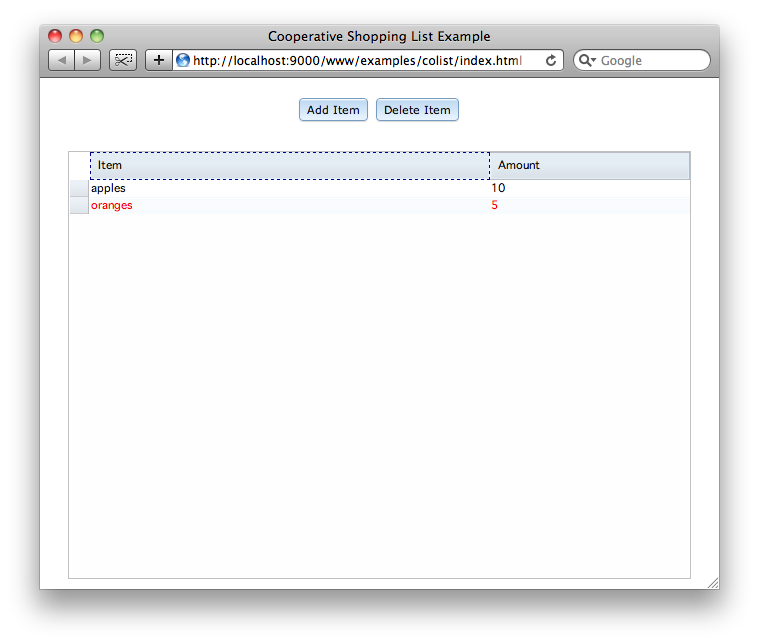

.. reviewed 0.4
.. include:: /replace.rst

Creating a cooperative shopping list
------------------------------------

This tutorial explains how to build a cooperative shopping list application step-by-step. You start the tutorial by creating a single-user shopping list based on the Dojo :class:`dojox.grid.DataGrid` widget and :class:`dojo.data.ItemFileWriteStore` data store. Working through the tutorial, you will incrementally add coweb features including cooperative editing of list items, support for latecomers to the session, and basic awareness of where other users are editing.

The goal: A cooperative shopping list
~~~~~~~~~~~~~~~~~~~~~~~~~~~~~~~~~~~~~

To get started, first consider the application requirements. Note that these are slightly different from the ones described in the simpler example used throughout :doc:`/intro/openg`.

#. The shopping list has two attributes per item, name and quantity.
#. Any user can add, delete, or change any list item at any time.
#. Each cell in the list can hold free-form text editable by the user.
#. Edits to list items take effect when the user hits :kbd:`Enter`, not character-by-character.
#. Users can sort their views of the list independently of one another.
#. The list highlights rows that have remote user input focus.

The final version of our application will look something like the following.

   
   Screenshot of the complete cooperative shopping list application.

Setup a coweb server instance
~~~~~~~~~~~~~~~~~~~~~~~~~~~~~

The shopping list application requires a coweb server to operate. If you deployed the Java :file:`cowebx-apps.war` file or created a Python demo virtualenv according to the :doc:`install` instructions, your server environment has a copy of the completed application. You should view it now to better understand the features you are implementing. The default URL for the complete app is `http://your.domain:8080/cowebx-apps/colist/index.html`.

If you plan to develop your own copy of the shopping list application, you should create and deploy your code in a new Java WAR or a fresh coweb Python virtualenv. Follow the instructions below to setup a workspace for development.

Java
####

#. Use the :ref:`coweb Maven archetype <maven-archetype>` to initialize a new `mycolist` project.

   .. sourcecode:: console

      $ cd /desired/project/path
      $ mvn archetype:generate \
         -DarchetypeGroupId=org.opencoweb \
         -DarchetypeArtifactId=coweb-archetype

#. Run the application using or deploy it to your servlet container of choice. Pick a custom port if the default (8080) conflicts with another server.

   .. sourcecode:: console

      $ cd mycolist
      $ mvn jetty:deploy-war -Djetty.port=9001

Python
######

#. Install the Python server package and scripts to a :ref:`virtualenv <virtualenv-install>` or :ref:`system-wide <distutils-install>`.
#. Deploy an initial coweb application using the :file:`pycoweb` script.

   .. sourcecode:: console
   
      $ pycoweb deploy /desired/project/path/mycolist -t simple

#. Edit the generated :file:`/desired/project/path/mycolist/bin/run_server.py` container script, adding the following two lines to its :py:meth:`coweb.AppContainer.on_configure` method.

   .. sourcecode:: python
   
      # match admin url to what java version uses
      self.webAdminUrl = self.webRoot + 'mycolist/admin'
      # match static url to what java uses
      self.webStaticRoot = self.webRoot + 'mycolist/'

#. Run the coweb server. Remember to activate the virtualenv first if you installed to one. Pick a custom port if the default (8080) conflicts with another server.

   .. sourcecode:: console
   
      $ run_server.py --port=9001

Starting with a blank page
~~~~~~~~~~~~~~~~~~~~~~~~~~

You will start by creating an empty web application shell that loads the proper dependencies.

:file:`index.html`
##################

First, create an :file:`index.html` in your project folder if on does not already exist. This file will eventually contain the Dojo widgets for the shopping list. For now, it will just show some simple text so that you can test the app deployment.

.. note:: 

   For a Java project, all web files live under the :file:`mycolist/src/main/webapp` folder created by the archetype. For a Python project, all web files live in the root of the :file:`mycolist/www` folder created by the deploy script.

Seed the :file:`index.html` with the following markup. If you initialized the project using the Maven archetype, replace the default content.

.. sourcecode:: html

   <!DOCTYPE html>
   <html>
     <head>
       <meta charset="utf-8" />
       <title>Cooperative Shopping List Example</title>
       <link rel="stylesheet" href="colist.css" type="text/css" />
       
     </head>
     <body class="claro">
       <h1>Hello World!</h1>
     </body>
   </html>
   
:file:`main.js`
###############

Next create a :file:`main.js` file in your project folder. This file will configure and bootstrap the RequireJS loader, the coweb JavaScript APIs, and the main application controller.

.. sourcecode:: javascript

   // session admin loop configured under same path as app page
   var cowebConfig = {adminUrl : './admin'};
   // js libs initialized here too
   require({
       paths : {
           coweb : 'lib/coweb',
           org : 'lib/org'
       }
   }, ['colist']);

:file:`colist.js`
#################

Next create the :file:`colist.js` file in your project folder. This file will contain the application specific code that runs on page load. By the end of the tutorial, it will initialize local widgets and join the application to a coweb session. Start by seeding the file with the following content.

.. sourcecode:: javascript

   define([
      'coweb/main',
      'http://ajax.googleapis.com/ajax/libs/dojo/1.6/dojo/dojo.xd.js'
   ], function(coweb) {
      dojo.ready(function() {
         console.log('ready callback');
      });
   });

The :func:`define` call indicates this JavaScript module is in AMD format. Its first parameter, an array, indicates other modules and/or plain scripts to load. `coweb/main` refers to the main module of the |coweb api|. The second script is a cross-domain, CDN hosted version of Dojo 1.6 that you will use to construct the shopping list UI. Dojo does not yet support AMD in its cross-domain builds, so the RequireJS loader treats it as a plain JavaScript file.

.. note:: This tutorial and the complete example use the CDN version of Dojo to limit the number of dependencies you must install. If you use Dojo 1.6 for your own applications, you should use a local, built copy of Dojo to improve your application's performance.

The :func:`dojo.ready` function registers a callback that will fire after the DOM finishes loading, all Dojo modules finish loading, and all declarative Dojo widgets in the DOM are instantiated. For the time being, the :func:`console.log` statement in the callback gives you something to check to ensure all of the dependencies are loading without error.

:file:`colist.css`
##################

Now create the :file:`colist.css` file in your project folder. You will define styles for the widgets in the shopping list as you add them. For now, add the following import statements to pull in the necessary Dojo Claro theme stylesheets.

.. sourcecode:: css

   @import "http://ajax.googleapis.com/ajax/libs/dojo/1.6/dojo/resources/dojo.css";
   @import "http://ajax.googleapis.com/ajax/libs/dojo/1.6/dijit/themes/claro/claro.css";
   @import "http://ajax.googleapis.com/ajax/libs/dojo/1.6/dojox/grid/resources/Grid.css";
   @import "http://ajax.googleapis.com/ajax/libs/dojo/1.6/dojox/grid/resources/claroGrid.css";

Checkpoint: Running the blank application
#########################################

You should test your application at this point to ensure you can access it in a web browser after deploying it. If you're working with Java, run your build script and deploy your :file:`mycolist.war` file in your servlet container. If you're working with Python, do nothing other than start the server. Visit the application in your browser at http://localhost:9001/mycolist/index.html, modifying the port as appropriate to where your server is running.

If everything is working properly, the following should be possible in your application:

#. Your application should load when you visit it in your browser.
#. The JavaScript console should show the result of the log statement.

Adding the shopping list
~~~~~~~~~~~~~~~~~~~~~~~~

After confirming the basic application loads, you can proceed to add widgets to it. To satisfy the application requirements, you will include:

* A :class:`dojox.grid.DataGrid` widget with two columns, one for an item name and one for an amount
* A :class:`dojo.data.ItemFileWriteStore` to hold the data in the shopping list
* Two :class:`dijit.form.Button` widgets, one to add new items and one to delete selected items

All three of these classes are stock Dojo components, unaware of cooperative web events. You will first add them to the application as-is to make sure the shopping list works locally. When the application works properly standalone, then you will go about extending it for cooperation.

:file:`index.html`
##################

Open the :file:`index.html` file again. Remove the placeholder `<h1>` you added to the body in the prior section. Add the declarative markup for the Dojo widgets shown below as children of the `<body>` element.

.. sourcecode:: html

   

      

        <button id="addRowButton"
                type="button"
      	        dojoType="dijit.form.Button">Add Item</button>
      	<button id="removeRowButton"
      	        type="button"
      	        dojoType="dijit.form.Button">Delete Item</button>
      

      <table id="grid"
             dojoType="dojox.grid.DataGrid"
             autoWidth="true" 
             rowSelector="20px"
             disabled="true"
             columnReordering="true"
             region="center">
        <thead>
          <tr>
            <th width="400px" field="name" editable="true">Item</th>
            <th width="200px" field="amount" editable="true">Amount</th>
          </tr>
        </thead>
      </table>
   

The :class:`dijit.layout.BorderContainer` splits the application template area into regions. A :class:`dijit.layout.ContentPane` containing the add and remove :class:`dijit.form.Button` widgets occupies the top region. The :class:`dojox.grid.DataGrid` fills the center region.

The grid table defines two columns labeled :guilabel:`Item` and :guilabel:`Amount`. The columns are tied via their `field` attributes to the `name` and `amount` attributes of items in the :class:`dojo.data.ItemFileWriteStore`.

:file:`colist.js`
#################

Edit the :file:`colist.js` file. Within the :func:`define` function, above the call to :func:`dojo.ready`, add the following additional calls to import the required Dojo widgets.

.. sourcecode:: javascript

   dojo.require('dojox.grid.DataGrid');
   dojo.require('dojo.data.ItemFileWriteStore');
   dojo.require('dijit.form.Button');
   dojo.require('dijit.layout.BorderContainer');
   dojo.require('dijit.layout.ContentPane');

Next, replace the :func:`console.log` call in the :func:`dojo.ready` callback with the following code.

.. sourcecode:: javascript

   // parse declarative widgets
   dojo.parser.parse();

   // configure the grid datastore, starting it empty
   var emptyData = {identifier : 'id', label : 'name', items: []};
   var dataStore = new dojo.data.ItemFileWriteStore({data : emptyData});
   var grid = dijit.byId('grid');
   grid.setStore(dataStore);

   /**
    * Adds a new row with default values to the local grid.
    */
   var rowId = 0;
   var onAddRow = function() {
      var id = rowId++; 
      dataStore.newItem({
         id: id,
         name: 'New item',
         amount: 0
      });
   };

   /**
    * Removes all selected rows from the grid.
    */
   var onRemoveRow = function() {
      grid.removeSelectedRows();
   };
    
   // listen to and enable add/delete buttons
   var addButton = dijit.byId('addRowButton');
   var removeButton = dijit.byId('removeRowButton');
   dojo.connect(addButton, 'onClick', onAddRow);
   dojo.connect(removeButton, 'onClick', onRemoveRow);

When the DOM finishes loading, your ready callback parses the DOM for declarative Dojo widgets, creates a :class:`dojo.data.ItemFileWriteStore`, sets it as the model of the :class:`dojox.grid.DataGrid`, and registers the :func:`onAddRow` and :func:`onRemoveRow` as click handlers for the :guilabel:`Add Item` and :guilabel:`Delete Item` buttons in the markup.

:file:`colist.css`
##################

Open the :file:`colist.css` file. Add the following style rules to center the grid and buttons properly.

.. sourcecode:: css

   html, body {
       margin: 0px;
       padding: 0px;
       overflow: hidden;
       width: 100%;
       height: 100%;
   }

   #container {
       width: 100%;
       height: 100%;
   }

   #controls {
       margin: 10px;
       text-align: center;
   }

   .dj_ie7 #controls {
       text-align: left;
   }

Checkpoint: Running the standalone app
######################################

You should test your application now to ensure the shopping list widgets work. The following should be possible now in your application:

#. You can click the :guilabel:`Add` button to create a new row in the grid.
#. You can double-click cells in the :guilabel:`Item` and :guilabel:`Amount` columns and edit their contents.
#. You can use the :kbd:`Tab` key to put focus in the grid, the arrow keys to move focus among the grid cells, and the :kbd:`Enter` key to start editing the focused cell.
#. You can click a column header to sort the rows by the values in that column. 
#. You can use the :kbd:`Tab` key to put focus on a column header, the arrow keys to move focus among the columns, and the :kbd:`Enter` key to sort by the focused column.
#. You can drag and drop the column headers to reorder them.
#. You can use the mouse and keyboard to select one or more rows and then click the :guilabel:`Delete` button to remove them.

Joining a session
~~~~~~~~~~~~~~~~~

Once satisfied that your shopping list works, you can begin making it cooperative. You should focus first on getting your application into a coweb session.

:file:`colist.js`
#################

Open the :file:`colist.js` file again. Add the following code to the bottom of the :file:`dojo.ready` callback.

.. sourcecode:: javascript

   // get a session instance
   var sess = coweb.initSession();
   // log status notifications to ensure we're working
   sess.onStatusChange = function(status) {
      console.debug(status);
   };
   // do the prep
   sess.prepare();
        
This code initializes the :class:`SessionInterface` and initiates the session :ref:`prepare <proto-session-prepare>`, :ref:`join <proto-session-join>`, and :ref:`update <proto-session-update>` sequence summarized below:

#. The :class:`SessionInterface` instance contacts the :attr:`cowebConfig.adminUrl` to prepare the coweb session. The admin responds with the URL of the session the application should join.
#. The instance contacts the session URL and performs the necessary handshake and event subscriptions.
#. The instance waits to receive the latest shared state, broadcasts it to the application when received, and finally notifies the application that it is ready to send and receive cooperative events.

Checkpoint: Running the standalone app
######################################

You should test your application again to see if it joins a session now. You can verify this behavior by looking in the developer console of your browser for the expected status change notifications: `preparing`, `joining`, `updating`, `ready`.

Sharing data store changes
~~~~~~~~~~~~~~~~~~~~~~~~~~

Now that the application can join a session, it's time to make the primary editing operations of the shopping list cooperative: add, update, and remove. When a user performs one of these operations, all application instances in the session should reflect the change. Further, all instances should converge to the same list of items, even in the face of concurrent conflicting edits.

Fortunately, the :class:`dojo.data.ItemFileWriteStore` class supports callbacks whenever an item is added to, changed in, or removed from the data store. By registering for these callbacks, the application can send notices of changes in the local data store to remote data store instances whenever they occur. Conversely, the app can listen for changes from remote data stores and apply them to the local store.

As for conflict resolution and consistency, the application can rely solely on the operation engine in the coweb framework. If the application passes proper values to :func:`CollabInterface.sendSync`, the engine will deliver results to :func:`CollabInterface.subscribeSync` callbacks transformed to resolve conflicts.

:file:`CoopItemFileWriteStore.js`
#################################

Create a new file named :file:`CoopItemFileWriteStore.js` in your application folder. In this file, include the following lines to define it as a module with a dependency on the `coweb/main` module.

.. sourcecode:: javascript

   define([
      'coweb/main'
   ], function(coweb) {
      var CoopItemFileWriteStore;
      
      // class def to go here
      
      return CoopItemFileWriteStore;
   });

Next, define a class within the module body that will hold a reference to a :class:`dojo.data.ItemFileWriteStore` instance. The following sections flesh-out the details of this class.

Initialization
++++++++++++++

Set :class:`CoopItemFileWriteStore` to a constructor that stores the passed arguments in instance variables. Also, initialize the :class:`CollabInterface` instance the widget will use to send and receive cooperative events.

.. sourcecode:: javascript

   CoopItemFileWriteStore = function(args) {
      this.dataStore = args.dataStore;
      this.id = args.id;
         if(!this.dataStore || !this.id) {
            throw new Error('missing dataStore or id argument');
      }
      // initialize collab interface using the dojo widget id as the
      // id for the collab instance
      this.collab = coweb.initCollab({id : this.id});
      // listen for datastore 'change' messages sent by remote instances of 
      // this widget; the change messages include item ids to allow coweb to
      // check consistency on a per-item basis, rather than per-grid, so we
      // include the * here to listen to all change messages
      this.collab.subscribeSync('change.*', this, 'onRemoteChange');
   };
   
Look at the :func:`CollabInterface.subscribeSync` call. The first parameter indicates the name of the remote, cooperative event to observe. In this case, the instance wants to observe all remote events that start with `change.` followed by any text up to the next period. As you will see below, our callbacks for local changes send events in the form `change.<item id>` whenever an item is added, updated, or removed in the local data store. In effect, this :func:`CollabInterface.subscribeSync` call is registering for notifications of remote additions, updates, or removals in remote data stores.

Next add a method named :func:`_dsConnect`. You will use this private method repeatedly throughout the code to connect and disconnect callbacks to and from the local data store instance.

.. sourcecode:: javascript

   /**
    * Connects or disconnects the observer method on this instance to one
    * of the data store events.
    *
    * @param connect True to connect, false to disconnect
    * @param type 'insert', 'update', or 'delete'
    */
   CoopItemFileWriteStore.prototype._dsConnect = function(connect, type) {
      if(connect) {
         // get info about the data store and local functions
         var funcs = this.typeToFuncs[type];
         // do the connect
         var h = dojo.connect(this.dataStore, funcs.ds, this, funcs.coop);
         // store the connect handle so we can disconnect later
         this.dsHandles[type] = h;
      } else {
         // disconnect using the previously stored handle
         dojo.disconnect(this.dsHandles[type]);
         // delete the handle
         this.dsHandles[type] = null;
      }
   };

The method uses :func:`dojo.connect` and :func:`dojo.disconnect` to enable and disable the callback methods you will define shortly. The `type` parameter identifies which data store notification / callback pair should be enabled or disabled.

Edit the constructor to initialize the :attr:`typeToFuncs` and :attr:`dsHandles` instance variables. Also, connect the widget to insert, update, and delete notifications from the data store immediately.

.. sourcecode:: javascript

   var CoopItemFileWriteStore = function(args) {
      this.dataStore = args.dataStore;
      this.id = args.id;
      if(!this.dataStore || !this.id) {
         throw new Error('missing dataStore or id argument');
      }
      // stores dojo.connect handles for observers of the data store
      this.dsHandles = {};
      // maps data store events to methods on this instance for ease of
      // connecting and disconnecting data store listeners
      this.typeToFuncs = {
         update: {ds : 'onSet', coop: 'onLocalUpdate'},
         insert: {ds : 'onNew', coop: 'onLocalInsert'},
         'delete': {ds : 'onDelete', coop: 'onLocalDelete'}
      };
      // subscribe to local datastore events to start
      this._dsConnect(true, 'insert');
      this._dsConnect(true, 'update');
      this._dsConnect(true, 'delete');
      // initialize collab interface using the dojo widget id as the
      // id for the collab instance
      this.collab = coweb.initCollab({id : this.id});
      // listen for datastore 'change' messages sent by remote instances of 
      // this widget; the change messages include item ids to allow coweb to
      // check consistency on a per-item basis, rather than per-grid, so we
      // include the * here to listen to all change messages
      this.collab.subscribeSync('change.*', this, 'onRemoteChange');
   };

Callbacks for local changes
+++++++++++++++++++++++++++

You should now add the methods responsible for sending information about local changes to remote application instances. To do so, you first need a method that can serialize the an opaque item in the :class:`dojo.data.ItemFileWriteStore` to JSON for transmission. Create this method with the name :func:`_itemToRow` as follows:

.. sourcecode:: javascript

   /**
    * Serializes a flat item in the data store to a regular JS object with 
    * name/value properties.
    *
    * @param item Item from the data store
    * @return row Object
    */
   CoopItemFileWriteStore.prototype._itemToRow = function(item) {
      var row = {};
      dojo.forEach(this.dataStore.getAttributes(item), function(attr) {
         row[attr] = this.dataStore.getValue(item, attr);
      }, this);
      return row;
   };

This method takes any item from the data store as a parameter, loops over all of its attributes, and adds their names and values to a regular JavaScript object. The coweb framework can JSON-encode the new object to send to remote users whereas it cannot JSON-encode the original item.

Next define the callback methods for changes in the local :class:`dojo.data.ItemFileWriteStore` instance. The three callback names should match those stated in the :attr:`typesToFuncs` object (:func:`onLocalInsert`, :func:`onLocalUpdate`, :func:`onLocalDelete`) and their signatures should match those of the data store methods to which they are connected (:func:`onNew`, :func:`onSet`, :func:`onDelete`).

.. sourcecode:: javascript

    /**
     * Called when a new item appears in the local data store. Sends the new
     * item data to remote data stores.
     *
     * @param item New item object
     * @param parentInfo Unused
     */
    CoopItemFileWriteStore.prototype.onLocalInsert = function(item, parentInfo) {
        // get all attribute values
        var row = this._itemToRow(item);
        var value = {};
        value.row = row;
        // name includes row id for conflict resolution
        var id = this.dataStore.getIdentity(item);
        var name = 'change.'+id;
        this.collab.sendSync(name, value, 'insert');
    };

When a new item appears in the data store, this :func:`onLocalInsert` method first collects its values using :func:`_itemToRow`. Second, it packages the `row` object as the value to transmit. Third, it gets the identity assigned to the new item and builds the event name using it. Finally, it invokes the :func:`CollabInterface.sendSync` method to send the cooperative event to remote instances.

.. sourcecode:: javascript

    /**
     * Called when an attribute of an existing item in the local data store 
     * changes value. Sends the item data and the name of the attribute that
     * changed to remote data stores.
     *
     * @param item Item object that changed
     * @param attr String attribute that changed
     * @param oldValue Previous value of the attr
     * @param newValue New value of the attr
     */
    CoopItemFileWriteStore.prototype.onLocalUpdate = function(item, attr, oldValue, newValue) {
        // get all attribute values
        var row = this._itemToRow(item);
        // store whole row in case remote needs to reconstruct after delete
        // but indicate which attribute changed for the common update case
        var value = {};
        value.row = row;
        value.attr = attr;
        // name includes row id for conflict resolution
        var id = this.dataStore.getIdentity(item);
        var name = 'change.'+id;
        this.collab.sendSync(name, value, 'update');
    };

When the attribute of an item in the data store changes value, this :func:`onLocalUpdate` method serializes and sends the item in much same manner as :func:`onLocalInsert`. The only difference is that this method includes the name of the attribute that changed in addition to the `row` data to assist remote instances in determining what changed.

.. sourcecode:: javascript
    
    /**
     * Called when a item disappears from the local data store. Sends just the
     * id of the removed item to remote data stores.
     *
     * @param item Deleted item
     */
    CoopItemFileWriteStore.prototype.onLocalDelete = function(item) {
        var value = {};
        // name includes row id for conflict resolution
        var id = this.dataStore.getIdentity(item);
        var name = 'change.'+id;
        this.collab.sendSync(name, value, 'delete');
    };

When an item disappears from the data store, this :func:`onLocalDelete` method notifies remote instances of the deletion. Unlike the two methods above, it does not include the values of the removed item as they are no longer needed.

Callbacks for remote changes
++++++++++++++++++++++++++++

Just as the class must inform remote instances of local data store changes, it must also listen for messages about remote changes and integrate them into the local data store. You should now define the methods that will observe and process remote changes.

In the constructor, you subscribed a method named :func:`onRemoteChange` as the callback for `change.*` cooperative events. Define this method as follows:

.. sourcecode:: javascript

    /**
     * Called when a remote data store changes in some manner. Dispatches to
     * local methods for insert, update, delete handling.
     *
     * @param topic Full sync topic including the id of the item that changed
     * @param value Item data sent by remote data store
     */
    CoopItemFileWriteStore.prototype.onRemoteChange = function(args) {
       var value = args.value;
       // retrieve the row id from the name
       var id = args.name.split('.')[1];
       if(args.type === 'insert') {
         this.onRemoteInsert(id, value);
       } else if(args.type === 'update') {
         this.onRemoteUpdate(id, value);
       } else if(args.type === 'delete') {
         this.onRemoteDelete(id);
       }
    };

The code in this method looks at the `type` property of the event value and dispatches to more specific methods shown below. Remember, the `type` was set by the code in :func:`onLocalInsert`, :func:`onLocalUpdate`, or :func:`onLocalDelete`: whichever sent the cooperative event.

Now define the method to add remotely created items to the local data store.

.. sourcecode:: javascript
    
    /**
     * Called when a new item appears in a remote data store. Creates an item
     * with the same id and value in the local data store.
     *
     * @param id Identity assigned to the item in the creating data store
     * @param value Item data sent by remote data store
     */
    CoopItemFileWriteStore.prototype.onRemoteInsert = function(id, value) {
        // stop listening to local inserts
        this._dsConnect(false, 'insert');
        this.dataStore.newItem(value.row);
        // resume listening to local inserts
        this._dsConnect(true, 'insert');
    };

The second line of code in this method adds the name/value pairs of the item properties packaged in `value.row` to the local data store. But before adding the item, the code is careful to disconnect the listener for local data store changes to avoid a cooperative event storm. If left connected, the :func:`onLocalInsert` method would get invoked, the code in that method would send a duplicate event to remote instances, those instances would do the same, ad infinitum. After invoking :func:`newItem`, the code reconnects the listener for local events.

Note this approach to avoiding echoed events only works because :class:`dojo.data.ItemFileWriteStore` invokes our :func:`onLocalInsert` method synchronously within :func:`newItem`. If the addition of the item or the callback was asynchronous (as is the case in other data store implementations), the code would need another method of avoiding event ping-pong (e.g., including a remote flag on the item.)

Now define the methods needed to incorporate remote changes to existing items and remove remotely deleted items.

.. sourcecode:: javascript

    /**
     * Called when an item attribute changes value in a remote data store.
     * Updates the attribute value of the item with the same id in the local
     * data store.
     *
     * @param id Identity of the item that changed
     * @param value Item data sent by remote data store
     */
    CoopItemFileWriteStore.prototype.onRemoteUpdate = function(id, value) {
        // fetch the item by its id
        this.dataStore.fetchItemByIdentity({
            identity : id, 
            scope : this,
            onItem : function(item) {
                // stop listening to local updates
                this._dsConnect(false, 'update');
                var attr = value.attr;
                this.dataStore.setValue(item, attr, value.row[attr]);
                // resume listening to local updates
                this._dsConnect(true, 'update');
            }
        });
    };

    /**
     * Called when an item disappears from a remote data store. Removes the
     * item with the same id from the local data store.
     *
     * @param id Identity of the item that was deleted
     */
    CoopItemFileWriteStore.prototype.onRemoteDelete = function(id) {
        // fetch the item by its id
        this.dataStore.fetchItemByIdentity({
            identity : id, 
            scope : this,
            onItem : function(item) {
                // stop listening to local deletes
                this._dsConnect(false, 'delete');
                this.dataStore.deleteItem(item);
                // resume listening to local deletes
                this._dsConnect(true, 'delete');
            }
        });
    };

The code in these methods is more complex because the :class:`dojo.data.Identity` API supports both synchronous and asynchronous data stores. Again, the disconnect / reconnect approach to avoiding event ping-pong only works properly because the :class:`dojo.data.ItemFileWriteStore` implementations of :func:`fetchItemByIdentity`, :func:`setValue`, and :func:`deleteItem` are synchronous.

:file:`colist.js`
#################

Open :file:`colist.js` and first add the string `CoopItemFileWriteStore` to module dependency list.

.. sourcecode:: javascript

   define([
      'coweb/main',
      'CoopItemFileWriteStore',
      'http://ajax.googleapis.com/ajax/libs/dojo/1.6/dojo/dojo.xd.js'
   ], function(coweb, CoopItemFileWriteStore) {
      // etc.
   });

Next, replace the :func:`onAddRow` function with the following:

.. sourcecode:: javascript

   var onAddRow = function() {
       // make pseudo-unique ids
       var date = new Date();
       var id = String(Math.random()).substr(2) + String(date.getTime()); 
       dataStore.newItem({
           id: id,
           name: 'New item',
           amount: 0
       });
   };
   
The previous code assigned monotonically increasing IDs to new items. But after adding cooperation, remote users can end up creating new items at the same time. You must take care, therefore, to ensure two unique items do not receive the same ID. The new code generates pseudo-unique random IDs based on a random number and the current date and time.

Now modify the body of your :func:`dojo.ready` callback to include the following additional lines instantiating a :class:`colist.CoopItemFileWriteStore` instance before the call to prepare the session.

.. sourcecode:: javascript
   
   // instantiate our cooperative datastore extension, giving it a 
   // reference to the dojo.data.ItemFileWriteStore object
   var args = {dataStore : dataStore, id : 'colist_store'};
   var coopDataStore = new CoopItemFileWriteStore(args);

Checkpoint: Checking data store cooperation
###########################################

You should test your application now to confirm cooperation between two or more grids. The easiest way to perform this test is to open at least two browser windows on the same machine and then make edits in each. In addition to the features from the previous checkpoint, the following should be possible in your application at this point:

#. The busy dialog appears over your application while it attempts to join a session.
#. When you add a row in one shopping list, it appears in all of the others.
#. When you change an item name or amount in one list, the change occurs in the others.
#. When you delete one or more items in a list, the items are removed in other lists.
#. When an item name or value is updated in two or more lists simultaneously, the same value wins out in all of the lists so that they remain consistent.

Supporting late-joiners
~~~~~~~~~~~~~~~~~~~~~~~

With the current code, people who join a session late do not see any items added to the shopping list before they joined. The list stays in its empty, initial state. You should now add the necessary callbacks so that a late joining data store instance can initialize to the current state. To accomplish this, you must also define the callback that allows data store instances already in the session to provide their state to late comers.

:file:`CoopItemFileWriteStore.js`
#################################

Open the :file:`CoopItemFileWriteStore.js` file. At the bottom of the constructor, add the following lines of code to register the full state request and response callbacks.

.. sourcecode:: javascript

   // listen for requests from remote applications joining the session
   // when they ask for the full state of this widget
   this.collab.subscribeStateRequest(this, 'onGetFullState');
   // listen for responses from remote applications when this application
   // instance joins a session so it can bring itself up to the current 
   // state
   this.collab.subscribeStateResponse(this, 'onSetFullState');

Next, define the :func:`onGetFullState` callback function you just registered. The coweb framework invokes this method when a remote instance of this class is joining the session and needs to synchronize its state.

.. sourcecode:: javascript

    /**
     * Called when a remote instance of this widget is joining a session and
     * wants to get up to speed. This instance sends the joining one a 
     * serialized array of all the items in the data store.
     *
     * @param params Object with properties for the ready event (see doc)
     */
    CoopItemFileWriteStore.prototype.onGetFullState = function(token) {
        // collect all items
        var rows = [];
        this.dataStore.fetch({
            scope: this,
            onItem: function(item) {                
                var row = this._itemToRow(item);
                rows.push(row);
            }
        });
        this.collab.sendStateResponse(rows, token);
    };

When invoked, this callback uses our :func:`_itemToRow` method to serialize all of the content in the data store. It then invokes the :func:`CollabInterface.sendStateResponse` method to send the state to the joining instance. The token passed to this callback and provided to :func:`sendStateResponse` pairs the request for state with the eventual response.

Now implement the :func:`onSetFullState` callback you registered in the constructor. The coweb framework invokes this method when this instance is joining an on-going session and receives full state from a remote instance.

.. sourcecode:: javascript

    /**
     * Called when this instance of the widget is joining a session and wants
     * to get up to speed. A remote instance provides this widget with an
     * array of all the items in the data store.
     *
     * @param rows Array of row objects to be inserted as items
     */
    CoopItemFileWriteStore.prototype.onSetFullState = function(rows) {
        // stop listening to local insert events from the data store else
        // we'll echo all of the insert back to others in the session!
        // via our onLocalInsert callback
        this._dsConnect(false, 'insert');
        // add all rows to the data store as items
        dojo.forEach(rows, this.dataStore.newItem, this.dataStore);
        // now resume listening for inserts
        this._dsConnect(true, 'insert');
    };

This callback unserializes the rows received from a remote :func:`onGetFullState` method. It adds all of the rows to the data store as items after ensuring its local :func:`onLocalInsert` callback is not inadvertently invoked for each item.

Checkpoint: Testing data store improvements
###########################################

You should test your application now to confirm late joining browsers immediately see the up-to-date shopping list. The easiest way to perform this test is to open at least two browser windows on the same machine, make changes to the list, and then refresh one of the browsers. The state of the list in the refreshed browser should match that of the list in the other browser.

Providing remote user awareness
~~~~~~~~~~~~~~~~~~~~~~~~~~~~~~~

Now that the shopping list items are properly shared, you can focus on providing information about shopping list users. The initial requirements stated that users should be aware of where other users are editing the shopping list. To do so, you should highlight where remote user input focus lies in the :class:`dojox.grid.DataGrid` widget.

:file:`CoopGrid.js`
###################

Create a new file in the application folder named :file:`CoopGrid.js`. Add the following code to the file.

.. sourcecode:: javascript

   define([
       'coweb/main'
   ], function(coweb) {
       var CoopGrid = function(args) {
           this.grid = args.grid;
           this.id = args.id;
           if(!this.grid || !this.id) {
               throw new Error('missing dataStore or id argument');
           }
           // tracks focus info for remote instances of this widget, key: site id,
           // value: object with focused datastore item id and attr in the 
           // focused column
           this.focused = {};
           // this user's site id
           this.site = null;
           // listen for focus and style events on the grid
           dojo.connect(this.grid, 'onCellFocus', this, 'onFocusLocalCell');
           dojo.connect(this.grid, 'onStyleRow', this, 'onStyleRow');
           // initialize collab interface using the dojo widget id as the
           // id for the collab instance
           this.collab = coweb.initCollab({id : this.id});
           // listen for 'focus' messages sent by remote instances of this widget
           this.collab.subscribeSync('focus', this, 'onFocusRemoteCell');
           // listen for when this app instance is in the session and ready to 
           // send and receive events
           this.collab.subscribeReady(this, 'onReady');
           // listen for other sites leaving the session so we can cleanup their
           // focus tracking information
           this.collab.subscribeSiteLeave(dojo.hitch(this, 'onSiteLeave'));
           // listen for requests from remote applications joining the session
           // when they ask for the full state of this widget
           this.collab.subscribeStateRequest(dojo.hitch(this, 'onGetFullState'));
           // listen for responses from remote applications when this application
           // instance joins a session so it can bring itself up to the current 
           // state
           this.collab.subscribeStateResponse(dojo.hitch(this, 'onSetFullState'));        
       };
       var proto = CoopGrid.prototype;
    
       /**
        * Called when this local application instance is joined to a session and
        * has already received full state from another attendee in the session.
        * Stores the site id of this instance for later use.
        *
        * @param params Object with properties for the ready event (see doc)
        */
       proto.onReady = function(params) {
           this.site = params.site;
       };

       /**
        * Called when a remote application instance leaves the session. Removes
        * focus information for the leaving site and refreshes the grid view.
        *
        * @param params Object with properties for the ready event (see doc)
        */
       proto.onSiteLeave = function(params) {
           delete this.focused[params.site];
           this.grid.render();
       };

       /**
        * Called when a remote instance of this widget is joining a session and
        * wants to get up to speed. This instance send the joining one the list of
        * focused items.
        *
        * @param params Object with properties for the ready event (see doc)
        */
       proto.onGetFullState = function(token) {
           this.collab.sendStateResponse(this.focused, token);
       };

       /**
        * Called when this instance of the widget is joining a session and wants
        * to get up to speed. A remote instance provides this widget with its list
        * of focused items. This widget forces its grid to redraw so it can mark
        * those focused items.
        *
        * @param focused The state of the focused grid cells sent by a remote
        *   widget instance in its onGetFullState method
        */
       proto.onSetFullState = function(focused) {
           this.focused = focused;
           this.grid.render();
       };

       /**
        * Called when the grid is styling a row for display. Adds the class name
        * 'tutFocus' to any row that is focused in a remote instance of the grid.
        * Decides which rows to mark as focused based on item ids, NOT row index,
        * because the sort order might be different across remote instances of
        * the grid.
        *
        * @param row Row object including the row index as one of its properties
        */
       proto.onStyleRow = function(row) {
           // get the item shown in the row
           var item = this.grid.getItem(row.index);
           // abort if we couldn't find the item for this row
           if(!item) { return; }
           // get the id of the item shown in the row
           var id = this.grid.store.getIdentity(item);
           // look through which rows are focused
           for(var site in this.focused) {
               if(this.focused.hasOwnProperty(site)) {
                   // add the css class to rows that are focused in remote grids
                   // but ignore local
                   site = Number(site);
                   if(this.focused[site] === id && site !== this.site) {
                       row.customClasses += ' focused';
                   }
               }
           }
       };

       /**
        * Called when the user gives focus (keyboard or mouse) to a certain cell.
        * Figures out which item is shown in the row containing the focus.
        * Also figures out which attribute is shown in the selected column.
        * Sends the information to remote instances of this widget.
        *
        * @param cell Focused cell object from grid
        * @param rowIndex Index of row containing the focused cell
        */
       proto.onFocusLocalCell = function(cell, rowIndex) {
           // get item associated with row containing the focused cell
           var item = this.grid.getItem(rowIndex);
           // get identity of the item
           var id = this.grid.store.getIdentity(item);
           var value = {id : id};
           // send sync with no consistency maintenance
           this.collab.sendSync('focus', value, null);
           // store local focus too for late joiners
           this.focused[this.site] = id;
       };

       /**
        * Called when a remote widget instance reports focus on a cell.
        * Stores the id of the item associated with the row that is now focused
        * so it can be styled the next time the grid renders itself.
        *
        * @param args Received cooperative event
        */
       proto.onFocusRemoteCell = function(args) {
           // store the selected id and the site that has it selected
           this.focused[args.site] = args.value.id;
           this.grid.render();
       };
    
       return CoopGrid;
   });

The :class:`CoopGrid` class registers callbacks for grid focus and styling events when instantiated. It also registers observers for cooperative events concerning entry into a session, focus events from remote instances, notifications that remote instances of have left a session, and full state requests and responses for late joining. 

At runtime, the instance tracks which row in the grid the local user has given input focus. It sends the data store item ID of the local focused row to remote instances. When the local instance receives notification of a remote focus, it stores the ID of the focused item in a dictionary keyed by the unique site ID of the remote instance. The local instance forces its grid to re-render when it receives a remote change notification, and adds the CSS class `focused` to all remotely focused rows.

When a remote user leaves the session, the local :class:`CoopGrid` instance clears any information about that user's site in its dictionary and forces a grid render to remove its focus row highlight. When the local user joins a session late, the local instance receives a copy of the focus dictionary from a remote instance. It then forces a render of the grid to immediately show the current focus state for all remote users. Likewise, when a remote user joins a session late, the local :class:`CoopGrid` instance is able to provide the newcomer with its current focus dictionary.

:file:`colist.css`
##################

Open :file:`colist.css` and add the following CSS rule.

.. sourcecode:: css

   #grid .focused {
      color: red;
   }

:file:`colist.js`
#################

Open the :file:`colist.js` file for the last time. Add the `CoopGrid` module dependency.

.. sourcecode:: javascript

   define([
      'coweb/main',
      'CoopItemFileWriteStore',
      'CoopGrid',
      'http://ajax.googleapis.com/ajax/libs/dojo/1.6/dojo/dojo.xd.js'
   ], function(coweb, CoopItemFileWriteStore, CoopGrid) {
      // etc.
   });

Also, instantiate an instance of the class in the :func:`dojo.ready` callback. 

.. sourcecode:: javascript

   // instantiate our cooperative grid extension, giving it a reference
   // to the dojox.grid.DataGrid widget
   args = {grid : grid, id : 'colist_grid'};
   var coopGrid = new CoopGrid(args);

After these edits, your completed file should look something like the following:

.. sourcecode:: javascript

   define([
       'coweb/main',
       'CoopGrid',
       'CoopItemFileWriteStore',
       'http://ajax.googleapis.com/ajax/libs/dojo/1.6/dojo/dojo.xd.js'
   ], function(coweb, CoopGrid, CoopItemFileWriteStore) {
       dojo.require('cowebx.BusyDialog');
       dojo.require('dojox.grid.DataGrid');
       dojo.require('dojo.data.ItemFileWriteStore');
       dojo.require('dijit.form.Button');
       dojo.require('dijit.layout.BorderContainer');
       dojo.require('dijit.layout.ContentPane');

       // have to wrap class decl in ready when using dojo xd loader
       dojo.ready(function() {
           // parse declarative widgets
           dojo.parser.parse();

           // configure the grid datastore, starting it empty
           var emptyData = {identifier : 'id', label : 'name', items: []};
           var dataStore = new dojo.data.ItemFileWriteStore({data : emptyData});
           var grid = dijit.byId('grid');
           grid.setStore(dataStore);
    
           // instantiate our cooperative datastore extension, giving it a 
           // reference to the dojo.data.ItemFileWriteStore object
           var args = {dataStore : dataStore, id : 'colist_store'};
           var coopDataStore = new CoopItemFileWriteStore(args);
    
           // instantiate our cooperative grid extension, giving it a reference
           // to the dojox.grid.DataGrid widget
           args = {grid : grid, id : 'colist_grid'};
           var coopGrid = new CoopGrid(args);
        
           /**
            * Adds a new row with default values to the local grid.
            */
           var onAddRow = function() {
               // make pseudo-unique ids
               var date = new Date();
               var id = String(Math.random()).substr(2) + String(date.getTime()); 
               dataStore.newItem({
                   id: id,
                   name: 'New item',
                   amount: 0
               });
           };

           /**
            * Removes all selected rows from the grid.
            */
           var onRemoveRow = function() {
               grid.removeSelectedRows();
           };

           // listen to and enable add/delete buttons
           var addButton = dijit.byId('addRowButton');
           var removeButton = dijit.byId('removeRowButton');
           dojo.connect(addButton, 'onClick', onAddRow);
           dojo.connect(removeButton, 'onClick', onRemoveRow);
        
           // get a session instance
           var sess = coweb.initSession();
           // use a dojo busy dialog to show progress joining/updating
           cowebx.createBusy(sess);
           // do the prep
           sess.prepare();
       });
   });

Checkpoint: Checking grid highlights
####################################

Your application now meets all of the requirements we set forth at the beginning of this tutorial. You should test it using multiple browsers. In addition to the features from the previous checkpoint, the following should be possible in your finished application:

#. The text of a row is black when no remote user has focus on that row.
#. The text of a row is red when a remote user puts keyboard focus on that row.
#. When a user leaves the session, the focus for that user is no longer shown.

Going further
~~~~~~~~~~~~~

The code in this tutorial touches some aspects of the coweb framework, but not all of them. You can continue to learn about the available APIs by extending the shopping list application. The following are some suggestions about what you might attempt next.

* Add a list of users in the session.
* Add a text chat widget.
* Improve the display of remote user focus in the grid (e.g., include usernames, highlight specific cells, distinguish row focus from cell edit).
* Persist shopping list changes for the next time a user enters the session.
* Connect the shopping list to an external service for online orders.
* Add a session status status indicator. (The complete example uses a Dojo-based busy dialog available in the http://github.com/opencoweb/cowebx repository.)